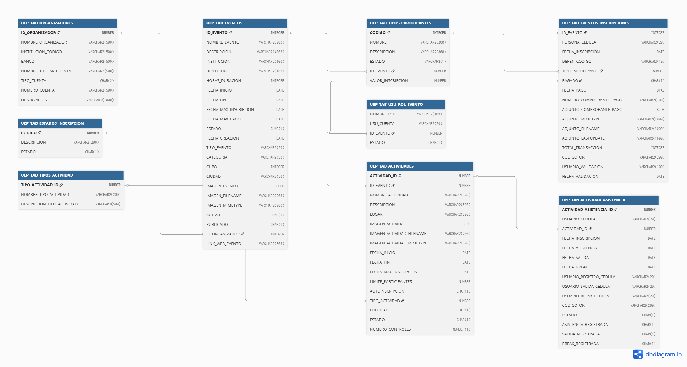

# UTN Móvil – Gestión de Eventos · SQL

Este repositorio contiene los **scripts SQL** del módulo **Gestión de Eventos** para su
**adaptación** sobre la **base de datos existente de la UTN**. El objetivo es **reutilizar**
las entidades ya disponibles y **agregar** las tablas/relaciones/roles necesarios para
acomodar el módulo de *Eventos*, manteniendo compatibilidad institucional.

---

## 📌 Diagrama y vista interactiva



- Diagrama interactivo: **dbdiagram.io** → https://dbdiagram.io/d/68dc423dd2b621e422ab1ba8

---

## Contenido del repositorio

```
utn-eventos-sql-repo/
├─ README.md
├─ assets/
│  └─ diagrama-relacional-eventos.png        # Diagrama/imagen de referencia (subir por el autor)
└─ scripts/
   ├─ 01_schema_objects.sql       # Tablas nuevas, FKs, inserts de roles y alters
   └─ 02_triggers.sql             # Triggers (autoinscripción / QR)
```

- **assets/diagrama-eventos.png**: imagen del **diagrama** de lo utilizado por el módulo
  (tablas existentes + tablas nuevas + relaciones). Este gráfico explica la **adaptación**
  sobre la BDD UTN.
- **scripts/01_schema_objects.sql**: incluye **creación de tablas**, **claves foráneas**,
  **inserción de roles**, **updates/alter** sobre tablas existentes y un bloque PL/SQL
  **opcional** para inicializar **códigos QR** en inscripciones existentes.
- **scripts/02_triggers.sql**: agrupa **exclusivamente los triggers** provistos por el autor.

---

## Ejecución (orden y prerrequisitos)

1. Verifique que está conectado a un **esquema Oracle** con permisos para **crear objetos**
   y ejecutar **DBMS_CRYPTO** / **UTL_RAW** (para los hashes de QR).
2. Ejecute **`sql/01_schema_objects.sql`** (objetos, FKs, inserts, alters, bloque PL/SQL opcional).
3. Ejecute **`sql/02_triggers.sql`** (definición de triggers).

> Recomendado: primero en un entorno **DEV/QA**. Estos scripts asumen la existencia de
> tablas institucionales previas (p.ej., `UEP_TAB_EVENTOS`, `UEP_TAB_EVENTOS_INSCRIPCIONES`,
> `SEG_TAB_ROLES`, `INS_TAB_USUARIOS`).

---

## Descripción funcional breve

- **Nuevas tablas**:
  - `UEP_TAB_ACTIVIDADES`: catálogo de actividades por evento (autoinscripción, nº controles, etc.).
  - `UEP_TAB_TIPOS_ACTIVIDAD`: tipificación de actividades.
  - `UEP_TAB_ACTIVIDAD_ASISTENCIA`: inscripciones a actividades + marcas de asistencia (**Entrada**, **Break**, **Salida**).
  - `UEP_TAB_ORGANIZADORES`: organizadores y cuentas bancarias.
  - `UEP_TAB_USU_ROL_EVENTO`: asignación de **roles** por **evento** (Registrador, Admin, Validador, DDTI).
- **Relaciones/FKs**: se enlazan actividades con eventos y tipos; asistencia con actividad; roles con `SEG_TAB_ROLES`, `INS_TAB_USUARIOS` y `UEP_TAB_EVENTOS`.
- **Roles iniciales**: inserciones en `SEG_TAB_ROLES` (**REGISTRADOR_EVENTOS**, **ADMINISTRADOR_EVENTOS**, **VALIDADOR_EVENTOS**, **ADMIN_DDTI_EVENTOS**).
- **Alteraciones**: agrega `ID_ORGANIZADOR` y `LINK_WEB_EVENTO` a `UEP_TAB_EVENTOS` (con FK a `UEP_TAB_ORGANIZADORES`); amplía `CODIGO_QR` a `VARCHAR2(200)` en `UEP_TAB_EVENTOS_INSCRIPCIONES`.
- **Triggers** (en `02_triggers.sql`):
  - `trg_auto_inscripcion_actividad`: autoinscribe a **actividades con AUTOINSCRIPCION='S'** cuando la inscripción del evento pasa a **pagada (3)**.
  - `trg_autoinscripcion_nueva_act`: al **marcar una actividad como autoinscribible**, inscribe a quienes ya tengan el evento pagado (3).
  - `trg_auto_qr_asistencia`: al insertar en asistencia, **rellena** el `CODIGO_QR` desde la inscripción de evento si viene nulo.
  - `trg_gen_qr_inscripcion`: al insertar inscripción de evento, **genera** `CODIGO_QR` con **hash SHA-256** sobre `ID_EVENTO:PERSONA_CEDULA`.

---

## Contexto de adaptación (BDD UTN)

Este trabajo **adapta** la base de datos **institucional existente**. Se **reutilizan** entidades
previas y se **agregan** las necesarias para el módulo *Gestión de Eventos*.  
El **diagrama** en `assets/diagrama-eventos.png` ilustra **qué se reutiliza** y **qué se incorpora**.

- El **script** crea/relaciona nuevas tablas para actividades, asistencia y organizadores; agrega FKs y
  amplía atributos (p. ej., `CODIGO_QR`).  
- Los **triggers** sincronizan inscripciones de actividades y asignan/generan códigos QR coherentes
  con el flujo definido en el **Manual de Usuario**.

